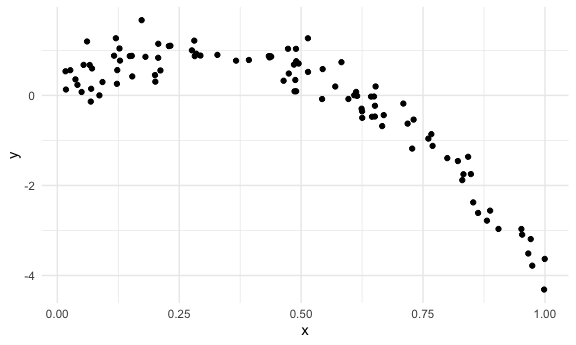

cross validation
================
2022-11-28

## Step one

cross validation “by hand” on simulated data

``` r
nonlin_df = 
  tibble(
    id = 1:100,
    x = runif(100, 0, 1),
    y = 1 - 10 * (x - .3) ^ 2 + rnorm(100, 0, .3)
  )

nonlin_df %>% 
  ggplot(aes(x = x, y = y)) + 
  geom_point()
```



Let’s get this by hand.

``` r
train_df = sample_n(nonlin_df,80)
test_df = anti_join(nonlin_df,train_df,by = "id") 
```

``` r
train_df %>% 
  ggplot(aes(x = x, y = y)) + 
  geom_point() +
  geom_point(data = test_df, color = "red")
```


let’s fit three models.

``` r
linear_mod = lm(y~x, data = train_df)
smooth_mod = mgcv::gam(y~s(x),data = train_df)
wiggly_mod = mgcv::gam(y~s(x, k = 30), sp = 10e-6, data = train_df)
```

let’s see the results.
