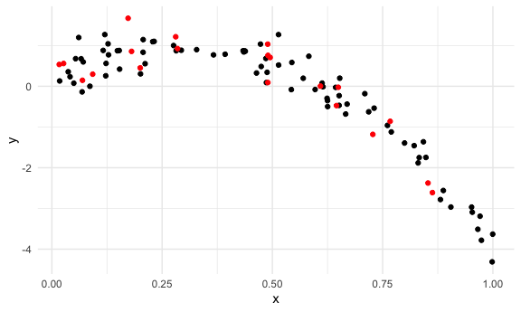

cross validation
================
2022-11-28

## Step one

cross validation “by hand” on simulated data

``` r
nonlin_df = 
  tibble(
    id = 1:100,
    x = runif(100, 0, 1),
    y = 1 - 10 * (x - .3) ^ 2 + rnorm(100, 0, .3)
  )

nonlin_df %>% 
  ggplot(aes(x = x, y = y)) + 
  geom_point()
```


Let’s get this by hand.

``` r
train_df = sample_n(nonlin_df,80)
test_df = anti_join(nonlin_df,train_df,by = "id") 
```

``` r
train_df %>% 
  ggplot(aes(x = x, y = y)) + 
  geom_point() +
  geom_point(data = test_df, color = "red")
```



let’s fit three models.

``` r
linear_mod = lm(y~x, data = train_df)
smooth_mod = mgcv::gam(y~s(x),data = train_df)
wiggly_mod = mgcv::gam(y~s(x, k = 30), sp = 10e-6, data = train_df)
```

let’s see the results.

``` r
train_df %>% 
  add_predictions(wiggly_mod) %>% 
  ggplot(aes(x=x, y=y))+
  geom_point()+
  geom_line(aes(y= pred), color = "red")
```


let’s make predictions and compute RMSEs.

``` r
rmse(linear_mod,test_df)
```

    ## [1] 0.8541991

``` r
rmse(smooth_mod,test_df)
```

    ## [1] 0.308864

``` r
rmse(wiggly_mod,test_df)
```

    ## [1] 0.4093148

## can we iterate…?

``` r
cv_df = 
  crossv_mc(nonlin_df,100) %>% 
  mutate(
    train = map(train, as_tibble),
    test = map(test, as_tibble)
  ) %>% 
  mutate(
    linear_fits = map(.x = train, ~lm(y~x, data = .x)),
    smooth_fits = map(.x = train, ~gam(y~s(x), data = .x)),
    wiggly_fits = map(.x = train, ~gam(y~s(x, k =30), sp = 10e-6, data = .x))
  ) %>% 
   mutate(
     rmse_linear = map2_dbl(.x = linear_fits, .y = test, ~rmse(model = .x, data = .y)),
     rmse_smooth = map2_dbl(.x = smooth_fits, .y = test, ~rmse(model = .x, data = .y)), 
     rmse_wiggly = map2_dbl(.x = wiggly_fits, .y = test, ~rmse(model = .x, data = .y))
  )
```

``` r
cv_df %>% pull(train) %>% .[[1]] %>% as_tibble
```

    ## # A tibble: 79 × 3
    ##       id     x        y
    ##    <int> <dbl>    <dbl>
    ##  1     1 0.592 -0.0784 
    ##  2     2 0.918 -2.53   
    ##  3     3 0.134  0.627  
    ##  4     4 0.810 -1.43   
    ##  5     6 0.676 -0.677  
    ##  6     7 0.403  0.709  
    ##  7    10 0.212  0.788  
    ##  8    12 0.518  0.00782
    ##  9    13 0.724 -0.683  
    ## 10    14 0.552 -0.123  
    ## # … with 69 more rows

what do these results say about the model choices?

``` r
cv_df %>% 
  select(starts_with("rmse")) %>% 
  pivot_longer(
    everything(),
    names_to = "model",
    values_to = "rmse",
    names_prefix = "rmse_ "
  ) %>% 
  ggplot(aes(x= model,y =rmse))+
  geom_violin()
```


compute average..

``` r
cv_df %>% 
  select(starts_with("rmse")) %>% 
  pivot_longer(
    everything(),
    names_to = "model",
    values_to = "rmse",
    names_prefix = "rmse_ "
  ) %>% 
  group_by(model) %>% 
  summarize(ave_rmse =mean(rmse))
```

    ## # A tibble: 3 × 2
    ##   model       ave_rmse
    ##   <chr>          <dbl>
    ## 1 rmse_linear    0.821
    ## 2 rmse_smooth    0.319
    ## 3 rmse_wiggly    0.393
